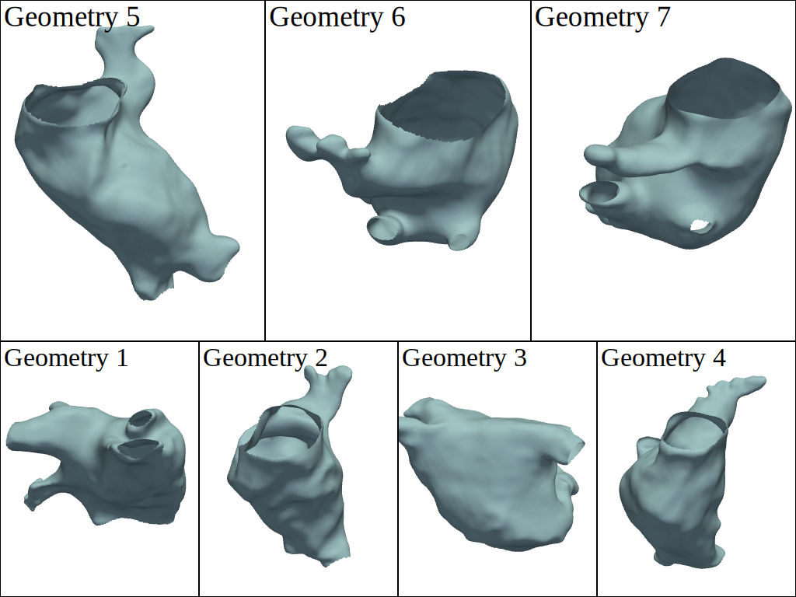

# Data

This folder contains the data used throughout this project.

For some basic examples, we use a [unit sphere mesh](./sphere.xml) sourced from [here](https://a654cc05c43271a5d22f-f8befe5e0dcd44ae0dccf352c00b4664.ssl.cf5.rackcdn.com/data/meshes/), and a coarse triangular mesh of the [left atrium](./left_atrium.ply) originally published [here](https://github.com/fsahli/FiberNet/blob/main/data/LA_model.vtk) and converted to a .ply file using [meshio](https://github.com/nschloe/meshio).

## Human Atrial Fibre Data (Roney et al.)

The main data source used in this project is the [human atrial fiber data set](https://zenodo.org/records/3764917) published by Roney et al. together with the corresponding [paper](https://link.springer.com/article/10.1007/s10439-020-02525-w). They provide triangular meshes of the left and right atrium separately for endocardium and epicardium for seven different atrial geometries. Each of the meshes is published as a .vtk file, which contains the universal atrial coordinates for each vertex as well as the fiber direction for each face. The latter is extracted from DT-MRI images. In addition, they include annotations of the anatomical structure for each face. These are contained in additional .elem files. See [`_extract_anatomical_tags_from_file()`](../prior_fields/tensor/reader.py#L67) for how the anatomical tags can be extracted.

In this project, we use the data of the left atrial endocardium (see [`data/LGE-MRI-based/`](./LGE-MRI-based/)) to parameterize the prior distribution of the fiber field (see [`data/parameters/`](./parameters/)). We utilize the universal atrial coordinates to map data between the seven geometries. [`uacs_fibers_tags.npy`](./uacs_fibers_tags.npy) contains the fiber data as well as the anatomical tag corresponding to all vertices from all geometries mapped to the UAC system.



### Reading the data

To read the data of one geometry, we provide the function [`read_raw_atrial_mesh()`](../prior_fields/tensor/reader.py#L20). The fibers and tags output by this function correspond to the faces of the mesh. To map all data to the vertices, as we do it before using it for our parameterization, use the function [`read_atrial_mesh_with_fibers_and_tags_mapped_to_vertices`](../prior_fields/tensor/reader.py#L101). You can also read the data of all geometries by using [`read_all_human_atrial_fiber_meshes()`](../prior_fields/tensor/reader.py#L217). This returns dictionaries with the outputs of `read_atrial_mesh_with_fibers_and_tags_mapped_to_vertices()`:

```python
from prior_fields.tensor.reader import (
    read_all_human_atrial_fiber_meshes,
    read_atrial_mesh_with_fibers_and_tags_mapped_to_vertices,
    read_raw_atrial_mesh
)
from prior_fields.tensor.parameterization import Geometry

g = Geometry(1)

# Read raw data for geometry 1
V, F, uac, fibers_F, tags_F = read_raw_atrial_mesh(g)

# Read data for geometry 1, where fibers and tags are mapped to the vertices
V, F, uac, fibers_V, tags_V = read_atrial_mesh_with_fibers_and_tags_mapped_to_vertices(g)

# Read the pre-processed data for all seven geometries
V_dict, F_dict, uac_dict, fibers_dict, tags_dict = read_all_human_atrial_fiber_meshes()
```
